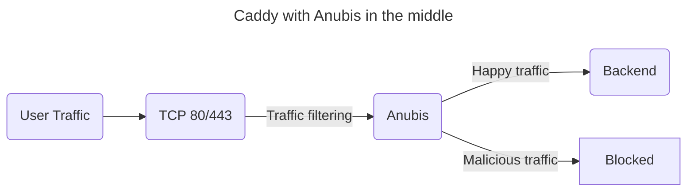

# Caddy

To use Anubis with Caddy, stick Anubis between Caddy and your backend. For example, consider this application setup:



Instead of your traffic going directly to your backend, it takes a detour through Anubis. Anubis filters out the "bad" traffic and passes the "good" traffic to the backend.

To set up Anubis with Docker compose and Caddy, start with a `docker-compose` configuration like this:

```yaml
services:
  caddy:
    image: caddy:2
    ports:
      - 80:80
      - 443:443
      - 443:443/udp
    volumes:
      - ./conf:/etc/caddy
      - caddy_config:/config
      - caddy_data:/data

  anubis:
    image: ghcr.io/techarohq/anubis:latest
    pull_policy: always
    environment:
      BIND: ":3000"
      TARGET: http://httpdebug:3000

  httpdebug:
    image: ghcr.io/xe/x/httpdebug
    pull_policy: always

volumes:
  caddy_data:
  caddy_config:
```

And then put the following in `conf/Caddyfile`:

```Caddyfile
# conf/Caddyfile

yourdomain.example.com {
  tls your@email.address

  reverse_proxy http://anubis:3000 {
		header_up X-Real-Ip {remote_host}
		header_up X-Http-Version {http.request.proto}
	}
}
```

If you want to protect multiple services with Anubis, you will need to either start multiple instances of Anubis (Anubis requires less than 32 MB of RAM on average) or set up a two-tier routing setup. With Caddy it is not necessary to run two instances as with [nginx](./nginx.mdx) or [Apache](./apache.mdx):
```Caddyfile
# conf/Caddyfile

yourdomain.example.com {
	# Frontend configuration to work before Anubis
	reverse_proxy unix//run/anubis/example/yourdomain.sock {
		header_up X-Real-Ip {remote_host}
		header_up X-Http-Version {http.request.proto}
	}
}

:80 {
	# Backend configuration to work behind Anubis
	bind unix//run/caddy/example/yourdomain-backend.sock

	# Your Caddy configuration for the backend
}
```

Note, that this `Caddyfile` uses Unix sockets instead of TCP connections to remove the overhead associated with network communication. This requires that Anubis and Caddy both can access the sockets. When using `systemd` add
```toml
[Service]
User=caddy
Group=caddy
```
to `/etc/systemd/system/anubis@.service.d/user.conf` to run Anubis under the user `caddy`. Then edit Caddy's service file with `sudo systemctl edit caddy.service` and add the `RuntimeDirectory` directive to the `[Service]` section to automatically create the directory:
```toml
[Service]
RuntimeDirectory=caddy/example
```
